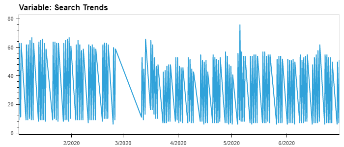
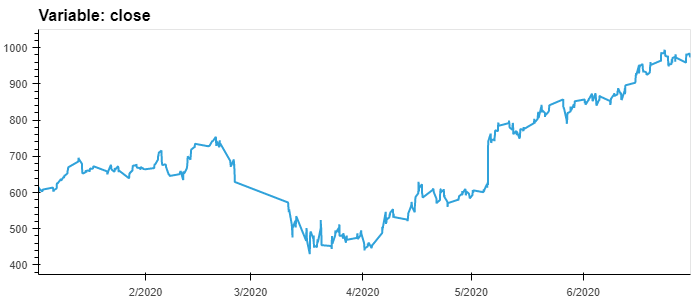
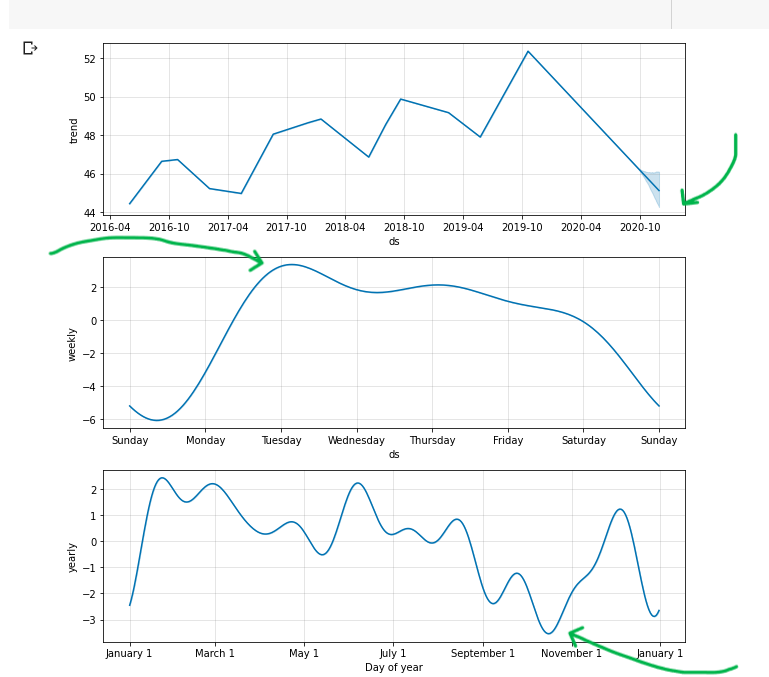
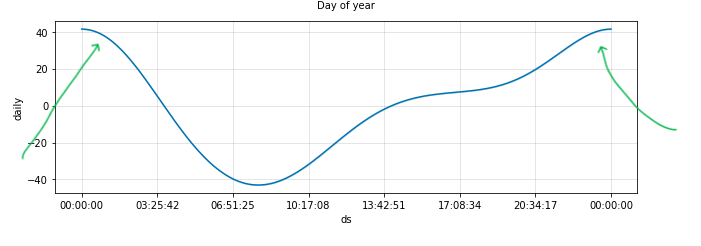
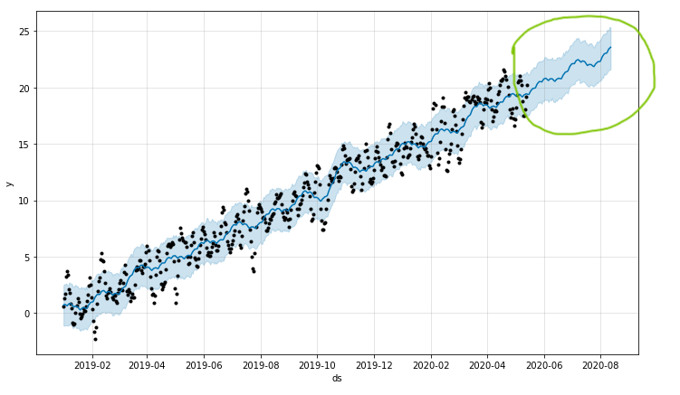

# Unit-11-Forecasting-Net-Prophet

Codelab → https://colab.research.google.com/drive/1-eZ-NmiJB2bVAj9q4gxf1ftpciBcSjDV?usp=sharing

---
### Finding 1

* From median traffic chart, the month of May 2020 (54) does not appear much higher or lower than other months. 
* However, from the 'Monthly Totoal' column, May 2020(38181) appear to be **high** compared to the same month in other years. From `May 2020 Hourly Traffic` heatmap below, this might be caused by unusual high traffic volumns around the 5th Day(`Dark Red`) in May 2020.

---
### Finding 2

* Traffic are increasingly concentrated (`Dark Green`) from afternoon of every day in a week, reaching peak around mid-night (10pm to 2am) every day, the pattens are mostly consistant throughout every day of the week.

---
### Finding 3
* Search traffic in winter Holiday (weeks 40 to 52) do not appear to be largely higher than other time in a year, however, traffic does pick up from annual low of weeks 35 to 40.

---
### Finding 4
* customers' search trend tends to be flat, share price had dropped and recoved.

---
### Time Serious Forcast Prophet Model Applied and Findings
* Near-term for the popularity is tredning downwords.
* Every day around between 10pm - 2am  exhibits the greatest popularity.
* Tuesday is the most search traffic, followed by Wednesday.
* Around early October, it shows the lowest search traffic in the calendar year.

For the focasting period of 2020-07-01 to 2020-09-30 (`Green Circle`)
* Revenue is forcasted to be trending up.
* the best case of total sales is  $2,320.The worst case is $1,984. The most likly expected total sale will be $2,152.(Quotes in millions of USD dollar)

